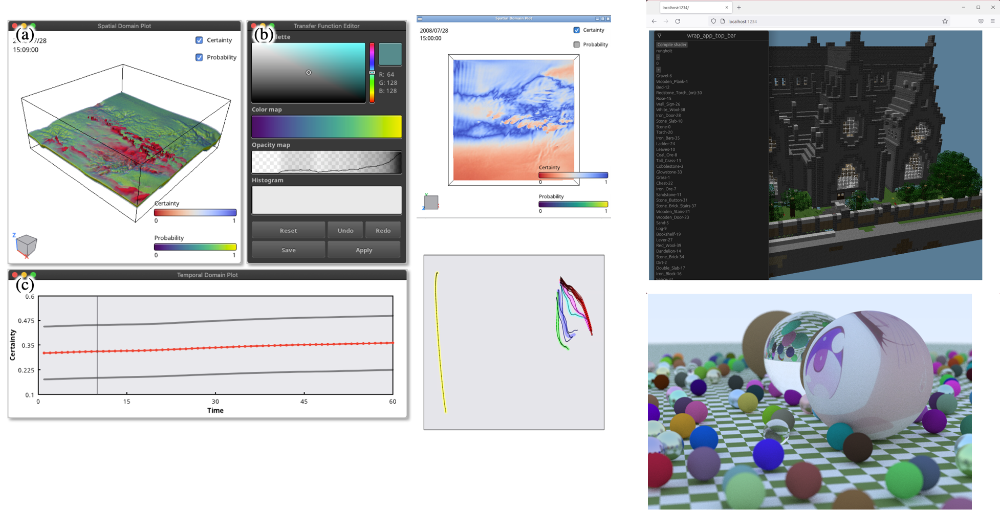

# About
----------------

## About me
田村 剛  
神戸大学大学院　システム情報学研究科  
計算科学専攻　シミュレーション技法研究室  
博士前期課程　2年  
〒657-8501 神戸市灘区六甲台町1-1  
208x211x[at]stu.kobe-u.ac.jp  
Github: [GoTamura](https://github.com/GoTamura)

大規模であるため可視化することの難しい気象のアンサンブルデータの可視化について研究しています。
3DCGやGPUに興味を持っています。  

----------------
## Education 
- 神戸大学工学部情報知能工学科  
  2016年4月 - 2020年3月卒業  
- 神戸大学大学院システム情報学研究科 計算科学専攻  
  2020年4月 - 2022年3月卒業見込み  

----------------
## Work 
- ソフトウェア/ハードウェアエンジニア WaveArrays株式会社 (2017.12-2018.12)
    - フェーズドアレイアンテナのFPGA信号処理回路の設計・実装  
    - フェーズドアレイアンテナのマイコン制御プログラムの実装
    - フェーズドアレイアンテナの受信データの解析

----------------
## Conferences
- New Development of Digital Beam Forming for Satellite Communications  
    Gou Tamura  
    International Astronautical Congress, Interactive Presentations, 2018.10.1-5, Bremen, Germany, ポスター発表

- 確率的等値面可視化技術を使った気象アンサンブルデータ分析  
    田村剛, 坂本尚久, 前島康光, 野中丈士  
    先進的可視化環境を用いた可視化情報の研究会(VR2019), 2020.01.23, 岐阜, 口頭発表  

- Visual Analysis of Meteorological Ensemble Data Sets by using Stochastic Isosurface Visualization  
    Go Tamura, Naohisa Sakamoto, Yasumitsu Maejima, Jorji Nonaka  
    The 2nd R-CCS International Symposium, Poster presentation, 2020.2.10, 神戸, ポスター発表  

- 確率的等値面を使った気象アンサンブルデータ向け視覚的分析  
    田村剛, 坂本尚久, 前島康光, 野中丈士  
    第48回可視化情報シンポジウム, 2020.9.23-26, オンライン  

- 確率的等値面技術をもとにした時系列気象アンサンブルデータ向け視覚的分析  
    田村剛, 坂本尚久, 前島康光, 野中丈士  
    日本流体力学会第34回数値流体力学シンポジウム, 2020.12.21-24, オンライン  

----------------
## Pojects

- WebGPUを使用したモデル表示ソフトウェア[[GitHub](https://github.com/GoTamura/modeling)]
- シンプルな関数型言語のインタープリタ[[GitHub](https://github.com/GoTamura/copl-solver)]
- レイトレーサー(WIP)[[GitHub](https://github.com/GoTamura/ray)]

----------------
## Skills
### Computer Languages
- できる  
    - C/C++  
    - Rust  
    - Shell 

- ちょっとできる  
    - python  
        基礎的なデータ処理
    - JavaScirpt  
      React.js(Next.js)でのブログサイトの構築
    - TeX, MATLAB, Verilog

### Technologies
- Linuxの管理  
    Arch/Ubuntu, Vim, Docker
- OpenGL, WebGL
- Unity
- Git

(Updated January 2021)

